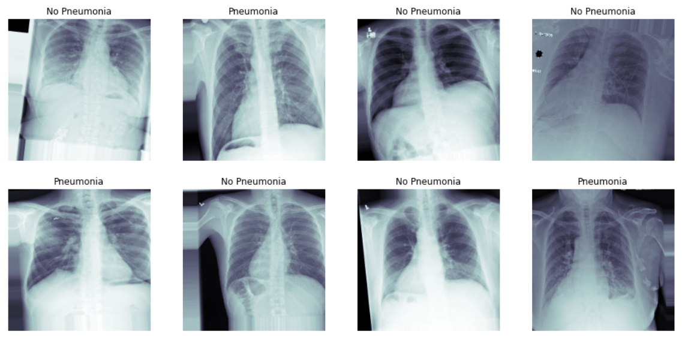

# Pneumonia Detection From Chest X-Rays

Pneumonia causes the death of around 700,000 children every year and affects 7% of the global population. Chest X-rays are primarily used for the diagnosis of this disease. However, even for a trained radiologist, it is a challenging task to examine chest X-rays and diagnose disease correctly. 

In this project, I will analyze data from the NIH Chest X-ray Dataset and train a CNN model to classify a given chest x-ray for the presence or absence of pneumonia. This project will culminate in a model that aims to predict the presence of pneumonia with human radiologist-level accuracy that can be prepared for submission to the FDA for 510(k) clearance as software as a medical device. As part of the submission preparation, I will formally describe my model, the data that it was trained on, and a validation plan that meets FDA criteria.

The project uses a dataset of 112,000 chest x-rays with disease labels acquired from 30,000 patients.

#### Example Chest X-Rays of patients with and without Pneumonia

## Project highlights

- Use imaging modalities for common clinical applications of 2D medical imaging 
- Perform exploratory data analysis (EDA) on medical imaging data to inform model training and explain model performance
- Establish the appropriate ‘ground truth’ methodologies for training algorithms to label medical images
- Extract images from a DICOM medical format dataset
- Train common CNN deep learning architectures to classify 2D medical images
- Translate outputs of medical imaging models for use by a clinician
- Plan necessary validations to prepare a medical imaging model for regulatory approval

## Key files

### June 2020

- [Exploratory Data Analysis of Chest X-ray dataset](https://github.com/pranath/pneumonia_detection/blob/master/EDA.ipynb)
- [Building & Training Model for Pneumonia Detection From Chest X-Rays](https://github.com/pranath/pneumonia_detection/blob/master/Build%20and%20train%20model.ipynb)
- [Pneumonia Detection Model - Clinical workflow integration test](https://github.com/pranath/pneumonia_detection/blob/master/Inference.ipynb)
- [FDA for 510(k) clearance report for Pneumonia Detection Model](https://github.com/pranath/pneumonia_detection/blob/master/FDA_Submission.pdf)

## Results

1. In the __[first project](https://github.com/pranath/pneumonia_detection/blob/master/Build%20and%20train%20model.ipynb)__ finished in June 2020, the best result was an overall F1 score for predicting Pneumonia of 0.03
